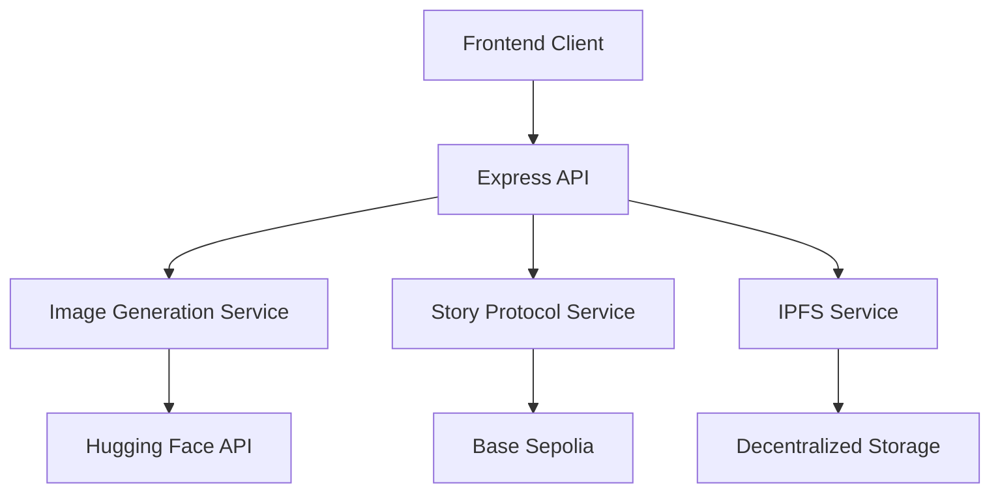
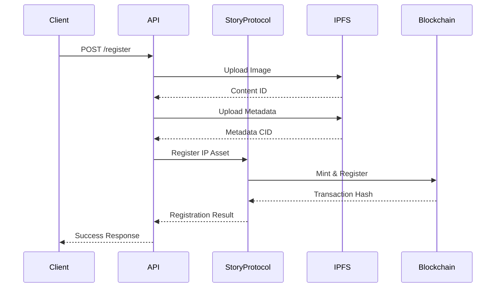

# System Patterns: Ablo Image Generator

## System Architecture

The Ablo Image Generator follows a client-server architecture with the following components:

### Frontend (Client-Side)

- React-based user interface
- Handles user interactions and form submissions
- Displays generated images
- Provides interface for IP registration
- Shows registration status and IP Asset details

### Backend (Server-Side)

- Express.js server with TypeScript
- Handles requests to Hugging Face API for image generation
- Implements Story Protocol SDK for blockchain interactions
- Manages authentication and authorization
- Stores temporary image data before registration

### External Services

- **Hugging Face API**: Provides text-to-image AI models
- **Story Protocol**: Handles IP Asset registration on the blockchain
- **Base Sepolia Network**: Blockchain testnet for development

## Key Technical Decisions

### 1. Story Protocol Integration Strategy

The application will use the `@story-protocol/core-sdk` package to interact with Story Protocol's smart contracts. The integration will:

- Register images as IP Assets using the `mintAndRegisterIpAssetWithPilTerms` method
- Store image metadata including the prompt used, attribution info, and timestamp
- Use Base Sepolia testnet for development with future plans for mainnet
- Implement wallet connection for transaction signing

### 2. Image Storage Approach

For blockchain registration, we will:

- Store image data temporarily on the server
- Hash the image content for unique identification
- Upload full-resolution images to IPFS or similar decentralized storage
- Store IPFS hash and metadata on the blockchain through Story Protocol

### 3. Authentication Model

Users will need to authenticate in two ways:

- Standard application authentication (username/password or social login)
- Web3 wallet connection for blockchain transactions (only required for registration)

To improve UX, we may implement:

- Account abstraction for easier onboarding
- Email wallet generation for non-crypto users

### 4. Error Handling Strategy

The application will implement robust error handling for:

- Hugging Face API errors (model unavailability, generation issues)
- Blockchain transaction errors (insufficient funds, rejected transactions)
- Network connectivity issues
- Wallet connection problems

### 5. Design Patterns in Use

- **Repository Pattern**: For data access abstraction
- **Service Layer Pattern**: For business logic separation
- **Factory Pattern**: For creating different types of requests
- **Strategy Pattern**: For supporting different image generation models
- **Observer Pattern**: For event-driven architecture (transaction status updates)
- **Proxy Pattern**: For controlled access to APIs
- **Adapter Pattern**: For integrating with different external services

## Component Relationships

```
+-----------------+       +------------------+        +----------------------+
|                 |       |                  |        |                      |
|  React Frontend +------>+  Express Backend +------->+  Hugging Face API    |
|                 |       |                  |        |                      |
+--------+--------+       +--------+---------+        +----------------------+
         ^                          |
         |                          |
         |                          v
         |                +---------+----------+       +----------------------+
         |                |                    |       |                      |
         +----------------+  Story Protocol    +------>+  Blockchain Network  |
                          |  SDK Integration   |       |                      |
                          |                    |       +----------------------+
                          +--------------------+
```

## Data Flow

1. User enters a text prompt on the frontend
2. Frontend sends prompt to the backend
3. Backend forwards request to Hugging Face API
4. Hugging Face returns generated image
5. Backend processes and sends image to frontend
6. User views image and can choose to register it
7. If registration requested, backend uses Story Protocol SDK
8. SDK creates transaction for blockchain registration
9. User signs transaction via connected wallet
10. Backend confirms successful registration
11. Frontend displays success message and IP Asset details

## Architecture Overview



## Service Layer

### Image Generation Service

- Handles text-to-image model inference
- Manages image format conversion
- Implements retry logic for API failures
- Uses Sharp for image processing

### Story Protocol Service

- Singleton pattern for client management
- Handles blockchain transactions
- Manages IP Asset registration
- Implements PIL terms configuration
- Uses viem for wallet operations

### IPFS Service (Planned)

- Will handle decentralized storage
- Will manage content addressing
- Will implement gateway fallbacks
- Will handle metadata storage

## Design Patterns

### Singleton Pattern

- Used in Story Protocol service
- Ensures single client instance
- Manages connection state
- Handles configuration updates

### Service Factory Pattern

- Creates service instances
- Manages dependencies
- Handles configuration injection
- Ensures proper initialization

### Repository Pattern

- Abstracts data access
- Handles blockchain queries
- Manages IPFS interactions
- Implements caching strategy

## Error Handling

### Blockchain Errors

```typescript
try {
  await storyClient.ipAsset.mintAndRegisterIpAssetWithPilTerms(/* ... */);
} catch (error) {
  if (error instanceof TransactionError) {
    // Handle transaction failures
  } else if (error instanceof NetworkError) {
    // Handle network issues
  } else {
    // Handle unexpected errors
  }
}
```

### API Error Responses

```typescript
{
  error: string;
  details: string;
  code?: string;
  transactionHash?: string;
}
```

## Validation Patterns

### Request Validation

- Uses express-validator
- Implements middleware pattern
- Validates all input fields
- Returns detailed error messages

### Blockchain Validation

- Validates wallet connection
- Checks network status
- Verifies gas availability
- Validates contract states

## Transaction Flow



## Configuration Pattern

### Environment Variables

- Strict validation using envalid
- Type-safe configuration
- Default values where appropriate
- Clear error messages

### Blockchain Configuration

```typescript
{
  chain: baseSepolia,
  account: privateKeyToAccount(config.privateKey),
  rpcUrl: config.rpcUrl,
  // Additional config...
}
```

## Testing Strategy

### Unit Tests

- Test service methods
- Mock blockchain calls
- Validate error handling
- Check state management

### Integration Tests

- Test API endpoints
- Validate transaction flow
- Check error responses
- Test retry logic

### E2E Tests (Planned)

- Test complete flow
- Check frontend integration
- Validate user experience
- Test network handling

## Service-Based Architecture

- Core services are implemented as singleton classes
- Services handle specific domains (IPFS, Story Protocol, Image Generation)
- Services are initialized at startup
- Dependency injection for service dependencies
- Clear separation of concerns between services

## Service Patterns

### IPFS Service

- Singleton pattern with lazy initialization
- Persistent blockstore using filesystem
- Automatic directory management
- Configurable retry mechanism
- Gateway fallback for content verification
- Content pinning with configuration
- Error handling with detailed logging

### Story Protocol Service

- Singleton pattern
- Blockchain interaction via SDK
- PIL terms configuration
- Asset registration and retrieval
- Transaction error handling
- Environment-based configuration
- Testnet/mainnet support

### Image Generation Service

- Hugging Face API integration
- Model configuration
- Format options (JPEG/PNG)
- Dimension customization
- Negative prompt support
- Error handling and validation

## Error Handling Patterns

- Custom error types for different scenarios
- Detailed error logging
- Graceful degradation
- Retry mechanisms where appropriate
- User-friendly error messages
- Transaction failure handling

## Configuration Patterns

- Environment-based configuration
- Validation at startup
- Sensible defaults
- Documentation in .env.example
- Type-safe configuration objects

## Testing Patterns

- Unit tests for services
- Integration tests for endpoints
- Mock blockchain interactions
- Test environment configuration
- Consistent test structure

## Security Patterns

- Environment variable protection
- Private key management
- API key security
- Rate limiting
- Input validation
- CORS configuration

## Logging Patterns

- Structured logging with Winston
- Log levels for different environments
- Transaction tracking
- Error context preservation
- Performance monitoring

## Future Considerations

- Caching layer implementation
- Queue system for long operations
- Monitoring system integration
- Metrics collection
- Automated deployment
- Scaling strategy
